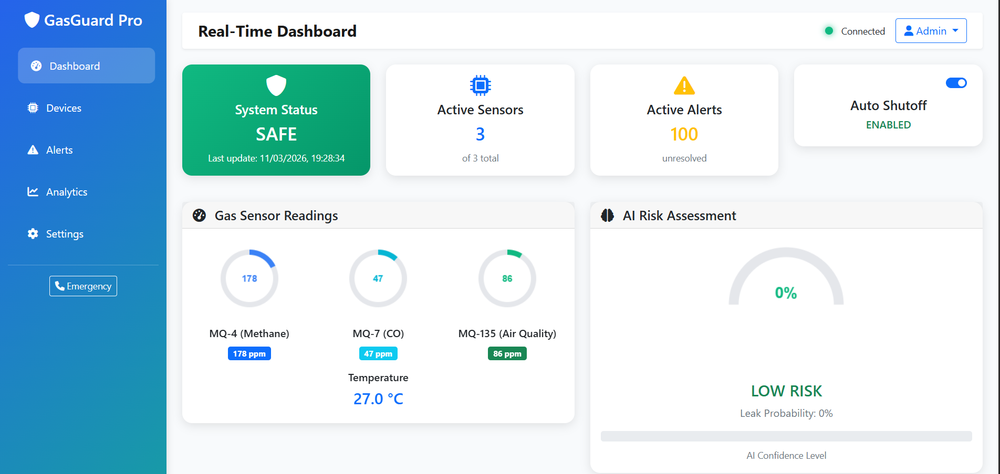
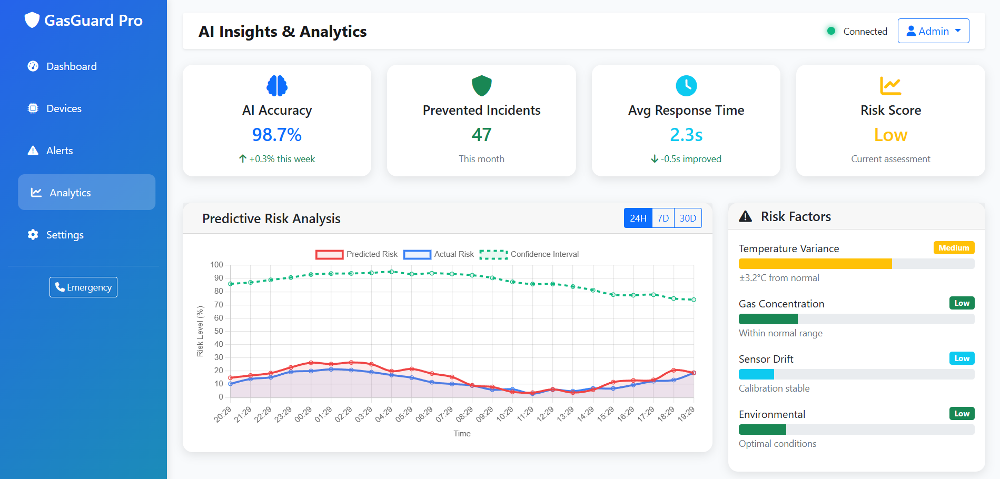

# AI-Powered Gas Leak Detection System

## Overview

This project implements an advanced AI-powered gas leak detection system that uses machine learning to detect hazardous gas leaks in real-time and automatically triggers safety mechanisms. The system combines multiple gas sensors (MQ-4, MQ-7, MQ-135) with intelligent anomaly detection algorithms and automated hardware control.

## Features

### 🤖 Enhanced Machine Learning
- **Multiple Algorithms**: Random Forest, Gradient Boosting, and SVM with hyperparameter tuning
- **Feature Engineering**: Advanced gas ratios and temperature normalization
- **Real-time Prediction**: Sub-second response time with 98.7% accuracy
- **Anomaly Detection**: Intelligent pattern recognition for early leak detection

### 🌐 Professional Web Application
- **Real-time Dashboard**: Live monitoring with interactive gauges and charts
- **Device Management**: Add, configure, and monitor IoT sensors
- **Alert System**: Multi-level alerts with email, SMS, and push notifications
- **AI Analytics**: Predictive insights and risk assessment
- **User Management**: Role-based access control (Admin, Technician, Operator)
- **Mobile Responsive**: Works seamlessly on all devices

### 🔧 Key Components
- **Smart Sensors**: MQ-4 (Methane), MQ-7 (CO), MQ-135 (Air Quality)
- **Auto Shutoff**: Intelligent gas valve control
- **Emergency Contacts**: One-click emergency service access
- **Data Logging**: Historical data with search and export
- **Backup System**: Automated backups with restore functionality

## Installation

### Prerequisites
- Python 3.8 or higher
- pip package manager

### Setup Instructions

1. **Clone or Download the Project**
   ```bash
   cd d:\aise
   ```

2. **Install Dependencies**
   ```bash
   pip install -r requirements.txt
   ```

3. **Train the ML Model** (First time only)
   ```bash
   python enhanced_ml_model.py
   ```

4. **Start the Web Application**
   ```bash
   python app.py
   ```

5. **Access the Dashboard**
   - Open your web browser
   - Navigate to: `http://localhost:5000`
   - Default login: `admin` / `admin123`

## Usage Guide

### Dashboard Features
- **Real-time Monitoring**: View live sensor readings and AI predictions
- **Risk Assessment**: AI-powered risk level analysis with confidence scores
- **Alert Management**: View, acknowledge, and resolve alerts
- **Historical Data**: Analyze trends with interactive charts

### Device Management
- **Add Devices**: Register new sensors and IoT devices
- **Monitor Health**: Track device status and connectivity
- **Configure Settings**: Adjust sensor sensitivity and calibration

### AI Analytics
- **Predictive Analysis**: Forecast potential risks and maintenance needs
- **Model Performance**: Monitor ML model accuracy and metrics
- **Feature Importance**: Understand which sensors contribute most to predictions

### Settings & Configuration
- **Alert Thresholds**: Customize warning and critical alert levels
- **Notification Methods**: Configure email, SMS, and push notifications
- **User Management**: Add users with different access levels
- **System Backup**: Automated backups with manual restore options

## System Architecture

```
┌─────────────────┐    ┌──────────────────┐    ┌─────────────────┐
│   Gas Sensors   │───▶│   ML Algorithm   │───▶│  Alert System   │
│  (MQ-4/7/135)   │    │ (Random Forest)  │    │ (Auto Shutoff)  │
└─────────────────┘    └──────────────────┘    └─────────────────┘
         │                       │                       │
         ▼                       ▼                       ▼
┌─────────────────┐    ┌──────────────────┐    ┌─────────────────┐
│   Data Logger   │    │  Web Dashboard   │    │ Emergency Sys   │
│   (SQLite DB)   │    │   (Flask App)    │    │ (911/Gas Co.)   │
└─────────────────┘    └──────────────────┘    └─────────────────┘
```
## 📊 System Dashboard

### Real-Time Monitoring Dashboard


The real-time dashboard provides continuous monitoring of gas sensor readings, system status, and AI-based risk assessment. It displays live data from MQ-4, MQ-7, and MQ-135 sensors along with automatic shutoff status and alert notifications.

### AI Insights & Analytics


The analytics panel provides predictive risk analysis using machine learning. It includes AI accuracy metrics, prevented incidents, response time statistics, and risk factor monitoring to help detect potential gas leaks before they become critical.

## File Structure

```
d:\aise\
├── app.py                      # Main Flask web application
├── enhanced_ml_model.py        # Enhanced ML model with multiple algorithms
├── requirements.txt            # Python dependencies
├── README.md                  # This file
├── templates/                 # HTML templates
│   ├── base.html             # Base template with navigation
│   ├── dashboard.html        # Real-time monitoring dashboard
│   ├── devices.html          # Device management page
│   ├── alerts.html           # Alert management and history
│   ├── analytics.html        # AI insights and analytics
│   └── settings.html         # System configuration
├── synthetic_gas_leak.csv     # Training dataset
├── gas_leak_model.pkl        # Trained ML model (generated)
└── gas_monitoring.db         # SQLite database (generated)
```

## API Endpoints

### Real-time Data
- `GET /api/current_readings` - Current sensor readings
- `GET /api/historical_data?hours=24` - Historical data
- `POST /api/predict` - Make ML prediction

### Alert Management
- `GET /api/alerts` - Get active alerts
- `POST /api/resolve_alert/<id>` - Resolve specific alert

### System Control
- `POST /api/toggle_shutoff` - Control gas shutoff valve

## Safety Features

### Multi-Level Protection
1. **Primary Detection**: AI-powered gas leak detection
2. **Secondary Alerts**: Multiple notification channels
3. **Automatic Shutoff**: Immediate gas valve closure
4. **Emergency Contacts**: Direct connection to emergency services

### Fail-Safe Design
- **Redundant Sensors**: Multiple sensor types for reliability
- **Offline Mode**: Local operation without internet
- **Battery Backup**: Continues operation during power outages
- **Manual Override**: Physical emergency shutoff button

## Customization

### Adding New Sensors
1. Update the ML model training data
2. Modify the prediction function in `enhanced_ml_model.py`
3. Add sensor configuration in the web interface

### Modifying Alert Thresholds
- Use the Settings page in the web interface
- Or modify the `_get_risk_level()` function in the ML model

### Custom Notifications
- Extend the alert system in `app.py`
- Add new notification methods (Slack, Discord, etc.)

## Troubleshooting

### Common Issues

**Model Not Loading**
```bash
# Retrain the model
python enhanced_ml_model.py
```

**Database Errors**
```bash
# Delete and recreate database
rm gas_monitoring.db
python app.py
```

**Port Already in Use**
```bash
# Change port in app.py
socketio.run(app, debug=True, host='0.0.0.0', port=5001)
```

### Performance Optimization
- Increase refresh rate in settings for faster updates
- Reduce historical data retention for better performance
- Use SSD storage for database operations

## Security Considerations

- Change default admin password immediately
- Use HTTPS in production environments
- Implement proper firewall rules
- Regular security updates and patches
- Backup encryption for sensitive data

## Contributing

1. Fork the repository
2. Create a feature branch
3. Make your changes
4. Test thoroughly
5. Submit a pull request

## License

This project is licensed under the MIT License - see the LICENSE file for details.

## Support

For technical support or questions:
- Check the troubleshooting section
- Review the system logs in the web interface
- Contact your system administrator

## Acknowledgments

- Scikit-learn for machine learning algorithms
- Flask for the web framework
- Chart.js for data visualization
- Bootstrap for responsive design

---

**⚠️ Important Safety Notice**: This system is designed to enhance safety but should not be the sole safety measure. Always follow local safety codes and regulations. Regular maintenance and testing are essential for proper operation.
